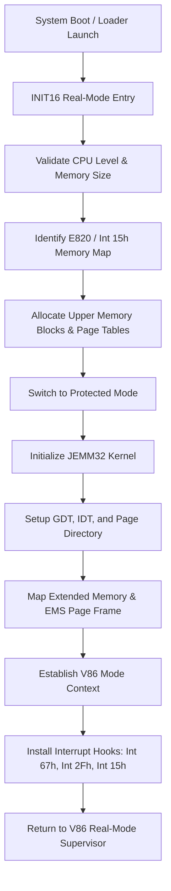
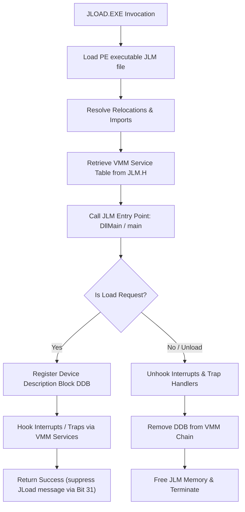
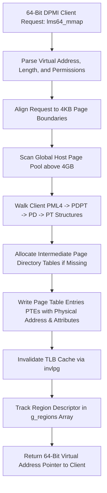

# EMM386 / JEMM Memory Manager Flowcharts & Architecture

This document maps out the core execution paths of the Jemm memory manager (JEMM16/JEMM32) and the loading procedure of Jemm Loadable Modules (JLMs).

---

## 1. JEMM Initialization Flow

The diagram below shows the system boot and initialization process when JEMM is loaded (either as a device driver in `config.sys` or dynamically via `JLOAD.EXE`).

---

## 2. JLM Loading & Linking Flow

This flowchart describes how `JLOAD` loads a Jemm Loadable Module (JLM) and registers its services using the List of Lists and VMM service tables.

---

## 3. 64-Bit DPMI & BSD Memory Mapping Flow (LMS64)

This flowchart details how a 64-bit DPMI client executes in x86-64 long mode, mapping memory above the 4GB physical boundary using standard BSD virtual memory specifications.

---

## 4. Maintenance Guidelines

### A. What We Can Change
- **Wrappers & Interface Helpers**: You can add logging wrappers, output debug hooks, and custom printf telemetry loops inside `.c` files.
- **Diagnostics**: You can modify screen rendering logic or register output formatters in debugging functions.
- **Local Helper Variables**: You can add internal local state flags or temporary arrays inside standard C functions that are not shared with assembly code.
- **Paging Policy**: You can modify the virtual address allocation base (e.g. `g_next_free_virt`) or adjust mapping region limit checks.

### B. What We Cannot Change
- **Struct Order & Alignment**: You cannot modify the member ordering or alignment constraints in shared structs (e.g. `Client_Reg_Struc`, `Client_Reg_Struc64`, `cb_s`, `Pushad_Struc` in `JLM.H` or `LMS64.H`) as their layout must align exactly with binary offsets expected by Assembly modules.
- **Hardware Register Mapping**: The register inputs and outputs (e.g. `RAX`, `RDX`, `RSP`) mapped to standard MS-DOS interrupts (e.g. Int 21h, Int 67h, Int 15h) must remain unmodified.
- **Service Ordinals**: The VxD/VMM service ordinal positions defined in `JLM.H` cannot be reordered or deleted because they match binary API indexes compiled into the memory manager kernel.

### C. What to Expect
- **V86 Memory Constraints**: Linear addresses used during file or device access must reside within a 64 KB offset distance from the V86 DS segment register.
- **Protected Mode Trapping**: Accessing ports or instructions outside normal privileges will trigger a VM monitor trap, routing control to the emulated handlers in `EMU.c` and `VDMA.c`.
- **4-Level Paging Latency**: Accessing unmapped virtual segments triggers a page fault exception, resolved dynamically by allocating intermediate paging directories.

### D. What to Do If Something Breaks / Troubleshooting
- **Compiler Options**: If Watcom C (`wcc386`) rejects options, verify the include directory paths are passed with double quotes (e.g. `"-I..\Include"`).
- **Binary Offsets Verification**: If the system locks up, dump structure sizes and trace alignment boundaries using map files (`*.map`) to ensure C structures align exactly with their Assembly definitions.
- **Check Git Status**: Run `git diff` or `git status` to verify that original tracked repository files (`JLM.H`, `HELLO2.C`) were not modified in a way that breaks existing toolchains.
